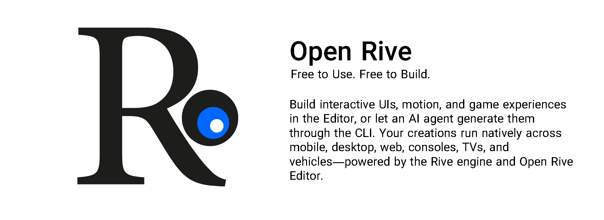
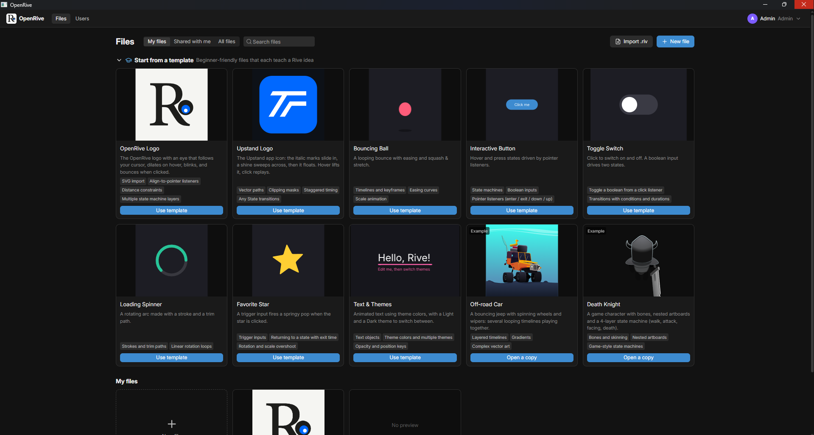

<p align="center">
  
</p>

<h1 align="center">OpenRive</h1>

<p align="center">
  An open-source, local-first editor for <a href="https://rive.app">Rive</a> <code>.riv</code> animations.<br/>
  Design, animate, build state machines, and export files that play in every official Rive runtime.<br/>
  No accounts. No cloud. Your files stay on your machine or your own server.
</p>


<p align="center">
  
</p>

<p align="center">
  <a href="docs/running-locally.md">Run locally</a> ·
  <a href="docs/self-hosting.md">Self-host</a> ·
  <a href="docs/README.md">Documentation</a> ·
  <a href="CONTRIBUTING.md">Contribute</a> ·
  <a href="#donations">Donate</a>
</p>


---

## Why OpenRive

- **Real `.riv` files.** OpenRive reads and writes the actual Rive runtime format. The reader/writer is generated from
  [rive-runtime](https://github.com/rive-app/rive-runtime)'s type definitions, and unmodified files round-trip byte for
  byte. This is checked against the runtime's 437 test files.
- **Official rendering.** The canvas is drawn by the official Rive WASM runtime, served locally, so what you see is what
  your app shows.
- **Local and login-free.** Projects live in PostgreSQL — embedded on your machine, a server when you self-host. Local
  users with roles replace accounts, and an optional access token protects a shared instance.
- **Everywhere you work.** A web app, a desktop build (Electrobun), a terminal UI, an MCP server for AI assistants and
  a REST API, all sharing one editing core.

## Features

| | |
| --- | --- |
| **Design** | Artboards, shapes (rectangle, ellipse, triangle, polygon, star), pen paths with vertex editing, groups, text with embedded fonts, fills and strokes (solid, linear and radial gradients), trim paths, blend modes, clipping |
| **Assets** | Assets tab: import PNG/JPG/WebP images (embedded in the `.riv`), SVGs (converted to editable vector shapes) and fonts; drag onto the canvas |
| **Animate** | Timelines with auto-keying, keyframe editing, hold, linear and cubic easing with a curve editor, ping-pong and loops |
| **Interactivity** | State machines with layers, transitions, conditions, number/boolean/trigger inputs, pointer listeners (including "follow the cursor"), live preview on the stage |
| **Theme colors** | Define colors once, link fills, strokes and keyframes to them, and switch themes (Light/Dark) to recolor the whole file |
| **Code** | Automation scripts (JavaScript on the OpenRive API) and ready-to-paste embed code for Web, React, Flutter, iOS and Android |
| **Templates** | Interactive OpenRive logo, Upstand logo, bouncing ball, button, toggle, spinner, star, text and themes, plus two example files (off-road car, death knight) |
| **Productivity** | 60+ rebindable keyboard shortcuts, context menus everywhere, editing presets, undo/redo, copy/paste between files |
| **Preview** | Full-screen preview with state machine inputs, view model (data binding) controls and an event log |
| **Team** | Local users with Admin / Editor / Viewer roles, sharing, and a user manager page |
| **Tools** | `openrive` terminal UI and CLI, MCP server (27 tools), REST API, Docker, desktop builds |
| **Stack** | Bun · Next.js 16 · React 19 · Zustand · Drizzle ORM + PostgreSQL · zod · Turborepo ([Better-T-Stack](https://better-t-stack.dev)) |

## Quick start

```bash
git clone https://github.com/UpstandPlatform/OpenRive.git
cd OpenRive
bun install
bun run dev
```

Open http://localhost:3000. On first run you'll find an interactive **Welcome to OpenRive** project: move your mouse
over the logo's eye. No database to set up — OpenRive runs an embedded PostgreSQL until you point `DATABASE_URL` at a
server.

Needs [Bun](https://bun.sh) 1.4+. Full guide: **[Running locally](docs/running-locally.md)**

## Desktop app

Prebuilt installers for macOS, Windows and Linux are attached to every release, or build your own:

```bash
bun run build:desktop
```

Full guide: **[Desktop app](docs/desktop.md)**

## Terminal UI

```bash
bun run cli            # or `openrive` after `bun link`
```

An [OpenTUI](https://opentui.com) interface for browsing, creating, exporting and deleting projects — plus the same
scriptable commands (`openrive new`, `export`, `validate`, `users`, `db status`). See **[CLI](docs/cli.md)**.

## Self-hosting

```bash
cp .env.example .env            # set OPENRIVE_ACCESS_TOKEN and POSTGRES_PASSWORD
docker compose up -d            # OpenRive + PostgreSQL
```

Works with Docker Desktop on Windows, macOS and Linux, or any server running Docker. A single-container
file-storage variant is also available (`docker-compose.standalone.yml`).

Full guide: **[Self-hosting](docs/self-hosting.md)**

## Documentation

All docs live in [`docs/`](docs/README.md):

- [Running locally](docs/running-locally.md) · [Self-hosting](docs/self-hosting.md) · [Desktop app](docs/desktop.md) · [Configuration](docs/configuration.md) · [Storage & PostgreSQL](docs/storage.md)
- [User guide](docs/user-guide.md) · [Keyboard shortcuts](docs/shortcuts.md) · [Templates](docs/templates.md) · [Theme colors](docs/theme-colors.md) · [Text & assets](docs/text-and-assets.md) · [Code panel](docs/code-panel.md)
- [CLI & terminal UI](docs/cli.md) · [MCP server](docs/mcp.md) · [REST API](docs/rest-api.md)
- [Architecture](docs/architecture.md) · [The .riv format](docs/file-format.md) · [Troubleshooting](docs/troubleshooting.md)

## Contributing

Contributions of all sizes are welcome: bug reports, templates, docs, features and file-format coverage.

- Start with **[CONTRIBUTING.md](CONTRIBUTING.md)**
- In-depth guides live in **[`contribution/`](contribution/README.md)**: development setup, code style, testing, adding
  templates, writing docs, and collaborating with AI agents and skills
- Use the [issue templates](.github/ISSUE_TEMPLATE) for bugs, feature requests and template ideas

## Donations

OpenRive is free and open source. If it saves you time, you can support its development:

| Network | Address |
| --- | --- |
| TON | `UQBglMTG79v4lv6j0CyhJSKaB8vNr704qUgcyA0CkUtGEZ7q` |


Thank you! Stars, bug reports and pull requests help too.

## License

OpenRive is released under the [MIT License](LICENSE).

OpenRive is an independent project and is not affiliated with or endorsed by Rive Inc. "Rive" is a trademark of
its owner. The bundled Rive WASM runtime and the example files in `public/examples` are © Rive and distributed under
the MIT license (see `apps/web/public/examples/LICENSE-rive-runtime.txt`). The Inter font is distributed under the SIL Open Font
License (`apps/web/public/fonts/OFL.txt`).
